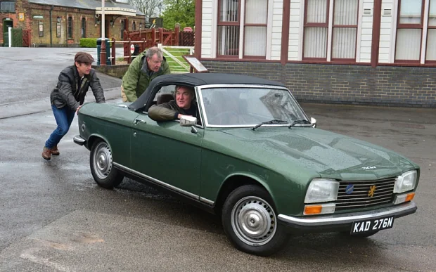

# mem
css practice mem with div's

<!DOCTYPE html>
<html lang="en">
<head>
  <meta charset="UTF-8">
  <meta name="viewport" content="width=device-width, initial-scale=1.0">
  <link rel="stylesheet" href="style.css">
  <title>Top Gear</title>
</head>
<body>
  

    
  

  <h1>THAT SPECIAL MOMENT</h1>
  <h3>when you run out of fuel</h3>
</body>
</html>
